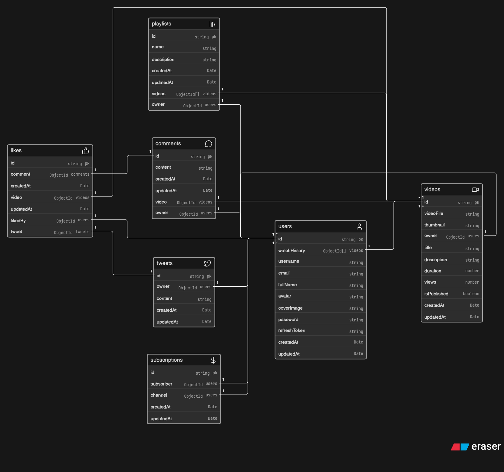

<div align="center">

# 🎥 YouTube Backend Clone


A complete **YouTube Backend Clone** built with **Node.js**, **Express.js**, **MongoDB**, and **Cloudinary** while following the **Chai aur Code Backend Series**.

This project provides a scalable **RESTful API** for a video-sharing platform featuring authentication, video management, playlists, comments, likes, subscriptions, tweets, dashboard analytics, and more.

</div>

---

# 🛠️ Tech Stack

| Technology                       | Purpose                                                                                                         |
| -------------------------------- | --------------------------------------------------------------------------------------------------------------- |
| **Node.js**                      | JavaScript runtime used to build the backend server.                                                            |
| **Express.js**                   | Lightweight web framework for creating REST APIs and handling routes & middleware.                              |
| **MongoDB**                      | NoSQL database used to store application data such as users, videos, comments, playlists, and subscriptions.    |
| **Mongoose**                     | ODM that provides schemas, models, validation, middleware, and aggregation support.                             |
| **JWT (JSON Web Tokens)**        | Implements secure authentication using Access Tokens and Refresh Tokens.                                        |
| **bcrypt**                       | Hashes user passwords before storing them securely in the database.                                             |
| **Cloudinary**                   | Cloud-based storage for videos, thumbnails, avatars, and cover images.                                          |
| **Multer**                       | Middleware for handling multipart/form-data and file uploads.                                                   |
| **Cookie Parser**                | Parses cookies to support secure authentication.                                                                |
| **CORS**                         | Enables secure communication between frontend and backend hosted on different origins.                          |
| **dotenv**                       | Manages environment variables and sensitive credentials.                                                        |
| **MongoDB Aggregation Pipeline** | Performs complex queries, joins, filtering, analytics, and dashboard statistics.                                |
| **REST API**                     | Standardized backend architecture using HTTP methods such as GET, POST, PATCH, and DELETE.                      |
| **MVC Architecture**             | Separates the project into Models, Controllers, and Routes for scalability and maintainability.                 |
| **Custom Utilities**             | Uses `asyncHandler`, `ApiError`, and `ApiResponse` for centralized error handling and consistent API responses. |
| **Git & GitHub**                 | Version control and source code management.                                                                     |
| **Postman**                      | API testing and endpoint verification.                                                                          |

---

# 🏗️ Database Architecture

## Entity Relationship Diagram




### Interactive Database Model

[https://app.eraser.io/workspace/KQKkCyub7XgUbc0tLFLe?origin=share](https://app.eraser.io/workspace/KQKkCyub7XgUbc0tLFLe?origin=share&diagram=B2QskPe1fUDFA8-6XaOix)

The ER diagram illustrates the relationships between:

* Users
* Videos
* Comments
* Likes
* Tweets
* Playlists
* Subscriptions

---

# 📂 Project Structure

```text
My-Backend-Project
│
├── public/
│   ├── database-schema.png    # Database ER diagram
│   └── temp/                  # Temporary storage for uploaded files
│
├── query/                     # MongoDB queries / aggregation examples
│
├── src/
│   ├── app.js                 # Express app configuration and middleware setup
│   ├── index.js               # Application entry point
│   ├── constants.js           # Application-wide constants
│   │
│   ├── controllers/           # Business logic for API endpoints
│   │   ├── user.controller.js
│   │   ├── video.controller.js
│   │   ├── comment.controller.js
│   │   ├── like.controller.js
│   │   ├── playlist.controller.js
│   │   ├── subscription.controller.js
│   │   ├── tweet.controller.js
│   │   ├── dashboard.controller.js
│   │   └── healthcheck.controller.js
│   │
│   ├── models/                # Mongoose schemas and database models
│   │   ├── users.model.js
│   │   ├── video.model.js
│   │   ├── comment.model.js
│   │   ├── like.model.js
│   │   ├── playlist.model.js
│   │   ├── subscription.model.js
│   │   └── tweet.model.js
│   │
│   ├── routes/                # API route definitions
│   │   └── user.routes.js
│   │
│   ├── middlewares/           # Custom Express middleware
│   │   ├── auth.middleware.js
│   │   └── multer.middleware.js
│   │
│   ├── db/
│   │   └── index.js           # MongoDB connection setup
│   │
│   └── utils/                 # Reusable helper functions
│       ├── ApiError.js
│       ├── ApiResponse.js
│       ├── asyncHandler.js
│       └── cloudinary.js
│
├── package.json               # Project metadata and dependencies
├── package-lock.json          # Dependency lock file
└── README.md                  # Project documentation
```


# 🚀 Features

## 🔐 Authentication

* User Registration
* User Login
* User Logout
* JWT Authentication
* Access Token & Refresh Token
* Password Encryption using bcrypt
* Change Password
* Update Profile
* Update Avatar
* Update Cover Image
* Watch History

---

## 🎥 Video Management

* Upload Videos
* Upload Thumbnails
* Cloudinary Integration
* Get All Videos
* Get Video by ID
* Update Video Details
* Delete Videos
* Publish / Unpublish Videos
* Search Videos
* Pagination
* Sorting

---

## 💬 Tweets

* Create Tweet
* Update Tweet
* Delete Tweet
* Fetch User Tweets

---

## 💭 Comments

* Add Comments
* Update Comments
* Delete Comments
* Get Video Comments

---

## ❤️ Likes

* Like / Unlike Videos
* Like / Unlike Comments
* Like / Unlike Tweets
* Fetch Liked Videos

---

## 📁 Playlists

* Create Playlist
* Update Playlist
* Delete Playlist
* Add Videos to Playlist
* Remove Videos from Playlist
* Fetch User Playlists

---

## 🔔 Subscriptions

* Subscribe to Channels
* Unsubscribe from Channels
* Fetch Subscriber List
* Fetch Subscribed Channels

---

## 📊 Dashboard

* Total Views
* Total Subscribers
* Total Videos
* Total Likes
* Channel Statistics

---

# ⚙️ Installation

## 1. Clone the Repository

```bash
git clone https://github.com/your-username/your-repository.git
```

## 2. Navigate to the Project

```bash
cd your-repository
```

## 3. Install Dependencies

```bash
npm install
```

## 4. Configure Environment Variables

Create a `.env` file in the project root.

```env
PORT=8000

MONGODB_URI=

ACCESS_TOKEN_SECRET=
ACCESS_TOKEN_EXPIRY=

REFRESH_TOKEN_SECRET=
REFRESH_TOKEN_EXPIRY=

CLOUDINARY_CLOUD_NAME=
CLOUDINARY_API_KEY=
CLOUDINARY_API_SECRET=

CORS_ORIGIN=
```

## 5. Start the Development Server

```bash
npm run dev
```

The backend server should now be running successfully.

---

# 📌 API Modules

* Authentication
* Users
* Videos
* Comments
* Likes
* Tweets
* Playlists
* Subscriptions
* Dashboard
* Health Check

---

# 🧠 Concepts Practiced

* REST API Development
* MVC Architecture
* Authentication & Authorization
* JWT Access & Refresh Tokens
* Secure Password Hashing
* Cookie-based Authentication
* File Uploads using Multer
* Cloudinary Integration
* MongoDB Aggregation Pipeline
* Pagination
* Search & Filtering
* MongoDB Relationships
* Mongoose Models
* Middleware
* Custom Error Handling
* Scalable Backend Design

---

# 🎯 Future Improvements

* Swagger / OpenAPI Documentation
* Docker Support
* Unit Testing
* Integration Testing
* CI/CD Pipeline
* Redis Caching
* Real-time Notifications
* Socket.io Integration
* Video Streaming Optimization

---

# 📚 Learning Source

This project was built while following the **Chai aur Code Backend Series** by **Hitesh Choudhary**.

To further strengthen my understanding, I also completed the assignment sections that were intentionally left unfinished during the course, resulting in a fully functional backend implementation.

---

# 🤝 Contributing

Contributions, suggestions, and improvements are welcome.

If you'd like to contribute:

1. Fork the repository.
2. Create a new feature branch.
3. Commit your changes.
4. Push the branch.
5. Open a Pull Request.

---

# 📄 License

This project is intended for **educational and learning purposes**. If you use this project, please give appropriate credit to the original Chai aur Code course that inspired it.

---

# 🙏 Acknowledgements

* **@hiteshchoudhary**
* **Chai aur Code**
* **Node.js**
* **Express.js**
* **MongoDB**
* **Mongoose**
* **Cloudinary**

---

<div align="center">

### ⭐ If you found this project helpful, consider giving it a Star!

</div>
